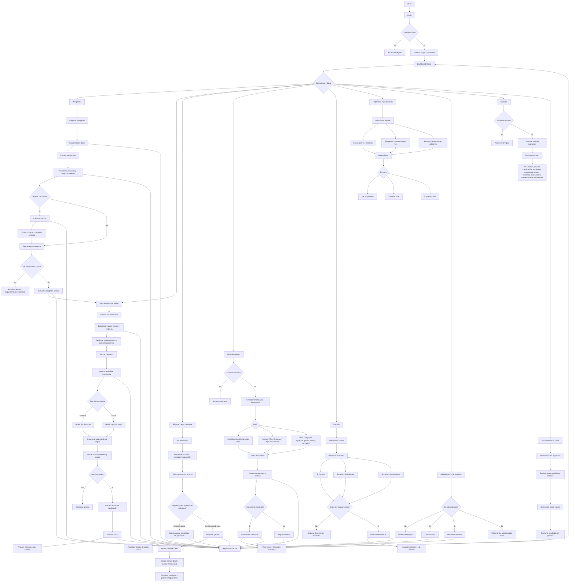

# Asociados

Tabla BD

```mermaid
erDiagram
    roles ||--o{ user_profiles : has
    catalog_groups ||--o{ catalog_items : contains

    user_profiles ||--o{ prospects : captures
    catalog_items ||--o{ prospects : status
    catalog_items ||--o{ prospects : activity_type
    catalog_items ||--o{ prospects : company_size

    prospects ||--o{ prospect_evaluations : has
    prospects ||--o{ prospect_quotes : has
    prospects ||--o{ prospect_status_history : tracks
    prospects o|--|| associates : converts_to

    categories ||--o{ prospects : current_category
    categories ||--o{ prospect_evaluations : suggested_category
    categories ||--o{ prospect_quotes : quoted_category
    categories ||--o{ associates : assigned_category
    categories ||--o{ memberships : membership_category

    catalog_items ||--o{ prospect_quotes : quote_status
    catalog_items ||--o{ prospect_status_history : previous_status
    catalog_items ||--o{ prospect_status_history : new_status

    catalog_items ||--o{ associates : associate_status
    catalog_items ||--o{ associates : activity_type
    catalog_items ||--o{ associates : company_size
    catalog_items ||--o{ associates : payment_health_status

    associates ||--o{ associate_people : has
    associates ||--o{ associate_area_contacts : has
    associates ||--o{ memberships : has
    associates ||--o{ payment_schedules : has
    associates ||--o{ payments : has
    associates ||--o{ collection_actions : has
    associates ||--o{ documents : has
    associates ||--o{ storage_nodes : roots
    associates ||--o{ associate_benefit_usages : uses
    associates ||--o{ associate_service_usages : consumes

    catalog_items ||--o{ associate_people : person_role
    catalog_items ||--o{ associate_area_contacts : area
    catalog_items ||--o{ memberships : membership_type
    catalog_items ||--o{ memberships : membership_status

    memberships ||--o{ payment_schedules : generates
    memberships ||--o{ payments : receives

    catalog_items ||--o{ payment_schedules : collection_status
    catalog_items ||--o{ payment_schedules : payment_health_status
    payment_schedules ||--o{ payments : settles
    payment_schedules ||--o{ collection_actions : tracked_by

    catalog_items ||--o{ payments : payment_method
    catalog_items ||--o{ collection_actions : contact_type
    catalog_items ||--o{ collection_actions : action_result

    committees ||--o{ associate_committees : links
    associates ||--o{ associate_committees : belongs_to
    committees ||--o{ committee_meetings : has
    committee_meetings ||--o{ documents : contains

    storage_nodes ||--o{ storage_nodes : parent_of
    storage_nodes ||--o{ documents : organizes
    catalog_items ||--o{ storage_nodes : node_type
    catalog_items ||--o{ documents : document_category
    catalog_items ||--o{ documents : document_type
    catalog_items ||--o{ documents : mirror_status
    documents o|--o| documents : replaces

    categories ||--o{ category_benefits : includes
    benefits ||--o{ category_benefits : assigned_to
    benefits ||--o{ associate_benefit_usages : used_in
    services ||--o{ associate_service_usages : used_in

    catalog_items ||--o{ benefits : benefit_type
    catalog_items ||--o{ services : service_type
    catalog_items ||--o{ services : responsible_area
    catalog_items ||--o{ associate_service_usages : service_status

    catalog_items ||--o{ drive_sync_jobs : status
    user_profiles ||--o{ audit_logs : acts

    roles {
        uuid id PK
        varchar code UK
        varchar name
        boolean is_active
    }

    user_profiles {
        uuid id PK
        uuid auth_user_id UK
        uuid role_id FK
        varchar institutional_email UK
        varchar dni UK
        boolean is_active
        boolean is_deleted
    }

    catalog_groups {
        uuid id PK
        varchar code UK
        varchar name
    }

    catalog_items {
        uuid id PK
        uuid group_id FK
        varchar code
        varchar label
        boolean is_active
        boolean is_deleted
    }

    categories {
        uuid id PK
        varchar code UK
        varchar name
        text description
        numeric min_score
        numeric max_score
        numeric base_fee
        integer sort_order
        boolean is_active
        boolean is_deleted
    }

    prospects {
        uuid id PK
        varchar company_name
        varchar ruc
        uuid prospect_status_id FK
        uuid current_category_id FK
        numeric suggested_fee
        numeric negotiated_fee
        uuid converted_to_associate_id FK
        boolean is_deleted
    }

    prospect_evaluations {
        uuid id PK
        uuid prospect_id FK
        numeric average_score
        uuid suggested_category_id FK
        numeric suggested_fee
        boolean is_current
        boolean is_deleted
    }

    prospect_quotes {
        uuid id PK
        uuid prospect_id FK
        varchar quote_number UK
        date issue_date
        uuid category_id FK
        numeric quoted_amount
        uuid quote_status_id FK
        boolean is_deleted
    }

    prospect_status_history {
        uuid id PK
        uuid prospect_id FK
        uuid previous_status_id FK
        uuid new_status_id FK
        timestamptz changed_at
        boolean is_deleted
    }

    associates {
        uuid id PK
        varchar internal_code UK
        varchar ruc UK
        varchar company_name
        uuid category_id FK
        uuid associate_status_id FK
        uuid prospect_origin_id FK
        numeric compliance_percentage
        boolean is_deleted
    }

    associate_people {
        uuid id PK
        uuid associate_id FK
        uuid person_role_id FK
        varchar full_name
        boolean is_primary
        boolean is_deleted
    }

    associate_area_contacts {
        uuid id PK
        uuid associate_id FK
        uuid area_id FK
        varchar full_name
        varchar email
        boolean is_primary
        boolean is_deleted
    }

    memberships {
        uuid id PK
        uuid associate_id FK
        uuid membership_type_id FK
        uuid category_id FK
        numeric fee_amount
        date start_date
        uuid membership_status_id FK
        boolean is_current
        boolean is_deleted
    }

    payment_schedules {
        uuid id PK
        uuid membership_id FK
        uuid associate_id FK
        date due_date
        numeric expected_amount
        uuid collection_status_id FK
        boolean is_paid
        boolean is_deleted
    }

    payments {
        uuid id PK
        uuid associate_id FK
        uuid membership_id FK
        uuid payment_schedule_id FK
        date payment_date
        numeric amount_paid
        varchar operation_code
        boolean is_reversed
        boolean is_deleted
    }

    collection_actions {
        uuid id PK
        uuid associate_id FK
        uuid payment_schedule_id FK
        timestamptz action_date
        uuid managed_by_user_id FK
        varchar subject
        boolean is_deleted
    }

    committees {
        uuid id PK
        varchar code
        varchar name
        boolean is_active
        boolean is_deleted
    }

    associate_committees {
        uuid id PK
        uuid associate_id FK
        uuid committee_id FK
        boolean is_active
        boolean is_deleted
    }

    committee_meetings {
        uuid id PK
        uuid committee_id FK
        varchar title
        date meeting_date
        text summary_ai
        boolean is_deleted
    }

    storage_nodes {
        uuid id PK
        uuid parent_id FK
        uuid node_type_id FK
        varchar name
        uuid associate_id FK
        uuid committee_id FK
        boolean is_deleted
    }

    documents {
        uuid id PK
        uuid storage_node_id FK
        uuid associate_id FK
        uuid prospect_id FK
        uuid committee_id FK
        uuid committee_meeting_id FK
        varchar title
        text storage_path UK
        integer version_number
        uuid replaces_document_id FK
        boolean is_latest_version
        boolean is_deleted
    }

    benefits {
        uuid id PK
        varchar code UK
        varchar name
        uuid benefit_type_id FK
        boolean requires_approval
        boolean is_active
        boolean is_deleted
    }

    category_benefits {
        uuid id PK
        uuid category_id FK
        uuid benefit_id FK
        boolean is_included
        boolean is_deleted
    }

    associate_benefit_usages {
        uuid id PK
        uuid associate_id FK
        uuid benefit_id FK
        date usage_date
        integer quantity
        boolean is_deleted
    }

    services {
        uuid id PK
        varchar code UK
        varchar name
        uuid service_type_id FK
        uuid responsible_area_id FK
        boolean is_active
        boolean is_deleted
    }

    associate_service_usages {
        uuid id PK
        uuid associate_id FK
        uuid service_id FK
        timestamptz requested_at
        timestamptz attended_at
        uuid service_status_id FK
        boolean is_deleted
    }

    drive_sync_jobs {
        uuid id PK
        varchar job_type
        uuid job_status_id FK
        timestamptz started_at
        timestamptz finished_at
    }

    audit_logs {
        uuid id PK
        timestamptz event_at
        uuid actor_user_id FK
        varchar entity_name
        uuid entity_id
        varchar action_type
    }
```



Diagrama de flujo



Flujo de Navegacion

```mermaid
flowchart TD
    A["/ login"] --> B["/app dashboard"]

    B --> C["/app/prospectos"]
    B --> D["/app/socios"]
    B --> E["/app/flujo-caja"]
    B --> F["/app/almacenamiento"]
    B --> G["/app/reportes"]
    B --> H["/app/auditoria"]
    B --> I["/app/usuarios"]
    B --> J["/app/sincronizacion-drive"]
    B --> K["/app/configuracion"]

    %% Prospectos
    C --> C1["/app/prospectos/nuevo"]
    C --> C2["/app/prospectos/:prospectoId"]
    C --> C3["/app/prospectos/:prospectoId/calculadora"]
    C --> C4["/app/prospectos/:prospectoId/cotizacion"]
    C --> C5["/app/prospectos/:prospectoId/historial"]
    C --> C6["/app/prospectos/:prospectoId/convertir"]

    C1 --> C3
    C3 --> C4
    C2 --> C3
    C2 --> C5
    C2 --> C6

    %% Socios
    D --> D1["/app/socios/:socioId"]
    D --> D2["/app/socios/:socioId/editar"]
    D --> D3["/app/socios/:socioId/contactos"]
    D --> D4["/app/socios/:socioId/membresia"]
    D --> D5["/app/socios/:socioId/documentos"]
    D --> D6["/app/socios/:socioId/inactivar"]

    D1 --> D2
    D1 --> D3
    D1 --> D4
    D1 --> D5
    D1 --> D6

    %% Flujo de caja y cobranza
    E --> E1["/app/flujo-caja/reporte"]
    E --> E2["/app/flujo-caja/pagos/nuevo"]
    E --> E3["/app/flujo-caja/cobranza"]
    E --> E4["/app/flujo-caja/cobranza/:gestionId"]
    E --> E5["/app/flujo-caja/socios/:socioId"]

    E3 --> E4
    E5 --> E2
    E5 --> E3

    %% Almacenamiento
    F --> F1["/app/almacenamiento/subir"]
    F --> F2["/app/almacenamiento/comites"]
    F --> F3["/app/almacenamiento/socios"]
    F --> F4["/app/almacenamiento/logotipos"]
    F --> F5["/app/almacenamiento/gaceta"]
    F --> F6["/app/almacenamiento/revista"]
    F --> F7["/app/almacenamiento/formatos"]

    %% Comités
    F2 --> F21["/app/almacenamiento/comites/:comiteId"]
    F21 --> F22["/app/almacenamiento/comites/:comiteId/reuniones"]
    F21 --> F23["/app/almacenamiento/comites/:comiteId/base-datos"]
    F21 --> F24["/app/almacenamiento/comites/:comiteId/actividades"]
    F21 --> F25["/app/almacenamiento/comites/:comiteId/cartas-oficios"]
    F21 --> F26["/app/almacenamiento/comites/:comiteId/constitucion"]

    F22 --> F221["/app/almacenamiento/comites/:comiteId/reuniones/:reunionId"]
    F221 --> F222["/app/almacenamiento/comites/:comiteId/reuniones/:reunionId/acta"]
    F221 --> F223["/app/almacenamiento/comites/:comiteId/reuniones/:reunionId/invitados"]
    F221 --> F224["/app/almacenamiento/comites/:comiteId/reuniones/:reunionId/asistentes"]
    F221 --> F225["/app/almacenamiento/comites/:comiteId/reuniones/:reunionId/resumen-ia"]

    %% Socios en almacenamiento
    F3 --> F31["/app/almacenamiento/socios/:anio"]
    F31 --> F32["/app/almacenamiento/socios/:anio/:empresa"]
    F32 --> F33["/app/almacenamiento/socios/:anio/:empresa/:tipoDocumento"]

    %% Gaceta
    F5 --> F51["/app/almacenamiento/gaceta/formato"]
    F5 --> F52["/app/almacenamiento/gaceta/grilla"]
    F5 --> F53["/app/almacenamiento/gaceta/:anio"]

    %% Revista
    F6 --> F61["/app/almacenamiento/revista/lineamientos"]
    F6 --> F62["/app/almacenamiento/revista/grilla"]
    F6 --> F63["/app/almacenamiento/revista/:anio"]

    %% Reportes
    G --> G1["/app/reportes/socios"]
    G --> G2["/app/reportes/prospectos-convertidos"]
    G --> G3["/app/reportes/cobranza"]
    G --> G4["/app/reportes/exportar/pdf"]
    G --> G5["/app/reportes/exportar/excel"]

    %% Auditoría
    H --> H1["/app/auditoria?usuario=:usuarioId"]

    %% Usuarios
    I --> I1["/app/usuarios/nuevo"]
    I --> I2["/app/usuarios/:usuarioId"]
    I --> I3["/app/usuarios/:usuarioId/editar"]
    I --> I4["/app/usuarios/:usuarioId/desactivar"]

    %% Drive
    J --> J1["/app/sincronizacion-drive/lotes"]
    J --> J2["/app/sincronizacion-drive/historial"]

    %% Configuración
    K --> K1["/app/configuracion/categorias"]
    K --> K2["/app/configuracion/catalogos"]
    K --> K3["/app/configuracion/comites"]
    K --> K4["/app/configuracion/parametros"]
```



estructuras de carpetas

```xml
src/
├── app/
│   ├── providers/
│   │   ├── AppProviders.tsx
│   │   ├── QueryProvider.tsx
│   │   ├── AuthProvider.tsx
│   │   ├── CatalogsProvider.tsx
│   │   └── ThemeProvider.tsx
│   ├── router/
│   │   ├── index.tsx
│   │   ├── routes.tsx
│   │   ├── guards/
│   │   │   ├── AuthGuard.tsx
│   │   │   ├── AdminGuard.tsx
│   │   │   └── RoleGuard.tsx
│   │   └── layouts/
│   │       ├── AuthLayout.tsx
│   │       ├── AppLayout.tsx
│   │       ├── AdminLayout.tsx
│   │       └── ModuleLayout.tsx
│   ├── store/
│   │   ├── ui.store.ts
│   │   ├── auth.store.ts
│   │   └── session.store.ts
│   └── index.tsx
│
├── pages/
│   ├── auth/
│   │   └── LoginPage.tsx
│   ├── dashboard/
│   │   └── DashboardPage.tsx
│   ├── not-found/
│   │   └── NotFoundPage.tsx
│   └── forbidden/
│       └── ForbiddenPage.tsx
│
├── features/
│   ├── auth/
│   │   ├── api/
│   │   │   └── auth.api.ts
│   │   ├── hooks/
│   │   │   ├── useAuth.ts
│   │   │   └── useSession.ts
│   │   ├── model/
│   │   │   ├── auth.types.ts
│   │   │   └── auth.schemas.ts
│   │   ├── components/
│   │   │   ├── LoginForm.tsx
│   │   │   └── LogoutButton.tsx
│   │   └── utils/
│   │       └── auth.mapper.ts
│   │
│   ├── users/
│   │   ├── api/
│   │   ├── hooks/
│   │   ├── model/
│   │   ├── components/
│   │   └── utils/
│   │
│   ├── catalogs/
│   │   ├── api/
│   │   │   └── catalogs.api.ts
│   │   ├── hooks/
│   │   │   └── useCatalogs.ts
│   │   ├── model/
│   │   │   └── catalogs.types.ts
│   │   └── utils/
│   │       └── catalogs.helpers.ts
│   │
│   ├── categories/
│   │   ├── api/
│   │   ├── hooks/
│   │   ├── model/
│   │   ├── components/
│   │   └── utils/
│   │
│   ├── prospects/
│   │   ├── api/
│   │   │   ├── prospects.api.ts
│   │   │   ├── prospect-evaluations.api.ts
│   │   │   └── prospect-quotes.api.ts
│   │   ├── hooks/
│   │   │   ├── useProspects.ts
│   │   │   ├── useProspectDetail.ts
│   │   │   ├── useProspectEvaluation.ts
│   │   │   └── useConvertProspect.ts
│   │   ├── model/
│   │   │   ├── prospect.types.ts
│   │   │   ├── prospect.schemas.ts
│   │   │   └── prospect.constants.ts
│   │   ├── components/
│   │   │   ├── ProspectTable.tsx
│   │   │   ├── ProspectForm.tsx
│   │   │   ├── ProspectStatusBadge.tsx
│   │   │   ├── MembershipCalculator.tsx
│   │   │   └── QuoteForm.tsx
│   │   ├── pages/
│   │   │   ├── ProspectsListPage.tsx
│   │   │   ├── ProspectCreatePage.tsx
│   │   │   ├── ProspectDetailPage.tsx
│   │   │   ├── ProspectCalculatorPage.tsx
│   │   │   └── ProspectQuotePage.tsx
│   │   └── utils/
│   │       ├── prospect.mapper.ts
│   │       └── prospect.rules.ts
│   │
│   ├── associates/
│   │   ├── api/
│   │   ├── hooks/
│   │   ├── model/
│   │   ├── components/
│   │   ├── pages/
│   │   └── utils/
│   │
│   ├── memberships/
│   │   ├── api/
│   │   ├── hooks/
│   │   ├── model/
│   │   ├── components/
│   │   └── utils/
│   │
│   ├── billing/
│   │   ├── api/
│   │   │   ├── payment-schedules.api.ts
│   │   │   ├── payments.api.ts
│   │   │   └── collection-actions.api.ts
│   │   ├── hooks/
│   │   ├── model/
│   │   ├── components/
│   │   ├── pages/
│   │   └── utils/
│   │
│   ├── storage/
│   │   ├── api/
│   │   │   ├── storage-nodes.api.ts
│   │   │   └── documents.api.ts
│   │   ├── hooks/
│   │   ├── model/
│   │   ├── components/
│   │   ├── pages/
│   │   └── utils/
│   │
│   ├── committees/
│   │   ├── api/
│   │   ├── hooks/
│   │   ├── model/
│   │   ├── components/
│   │   ├── pages/
│   │   └── utils/
│   │
│   ├── reports/
│   │   ├── api/
│   │   ├── hooks/
│   │   ├── model/
│   │   ├── components/
│   │   └── utils/
│   │
│   ├── audit/
│   │   ├── api/
│   │   ├── hooks/
│   │   ├── model/
│   │   ├── components/
│   │   └── pages/
│   │
│   ├── benefits/
│   │   ├── api/
│   │   ├── hooks/
│   │   ├── model/
│   │   ├── components/
│   │   └── pages/
│   │
│   └── services/
│       ├── api/
│       ├── hooks/
│       ├── model/
│       ├── components/
│       └── pages/
│
├── components/
│   ├── atoms/
│   │   ├── Button/
│   │   ├── Input/
│   │   ├── Select/
│   │   ├── Label/
│   │   ├── Badge/
│   │   ├── Icon/
│   │   ├── Spinner/
│   │   ├── Checkbox/
│   │   └── Text/
│   ├── molecules/
│   │   ├── FormField/
│   │   ├── SearchField/
│   │   ├── EmptyState/
│   │   ├── ConfirmDialog/
│   │   ├── FilterItem/
│   │   └── Pagination/
│   ├── organisms/
│   │   ├── DataTable/
│   │   ├── FiltersPanel/
│   │   ├── PageHeader/
│   │   ├── Sidebar/
│   │   ├── Topbar/
│   │   ├── AppShell/
│   │   └── FileUploader/
│   └── templates/
│       ├── ListPageTemplate/
│       ├── DetailPageTemplate/
│       ├── FormPageTemplate/
│       └── DashboardTemplate/
│
├── lib/
│   ├── supabase/
│   │   ├── client.ts
│   │   ├── auth.ts
│   │   ├── storage.ts
│   │   └── query-keys.ts
│   ├── env/
│   │   └── env.ts
│   ├── formatters/
│   │   ├── date.ts
│   │   ├── currency.ts
│   │   ├── phone.ts
│   │   └── file-size.ts
│   ├── validators/
│   │   ├── common.schemas.ts
│   │   ├── ruc.ts
│   │   ├── email.ts
│   │   └── phone.ts
│   ├── constants/
│   │   ├── routes.ts
│   │   ├── roles.ts
│   │   └── ui.ts
│   └── helpers/
│       ├── object.ts
│       ├── array.ts
│       ├── dates.ts
│       └── downloads.ts
│
├── hooks/
│   ├── useDebounce.ts
│   ├── useDisclosure.ts
│   ├── usePagination.ts
│   ├── useFilters.ts
│   └── useAsyncAction.ts
│
├── types/
│   ├── api.ts
│   ├── common.ts
│   ├── entities.ts
│   └── ui.ts
│
├── styles/
│   ├── globals.css
│   ├── tokens.css
│   └── utilities.css
│
├── assets/
│   ├── icons/
│   ├── images/
│   └── logos/
│
└── main.tsx
```