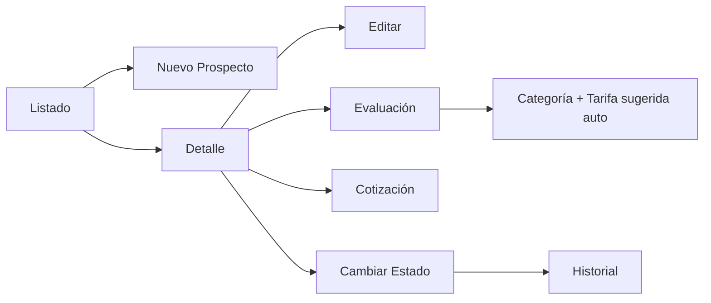

# Hito 4 — Módulo de Prospectos: Resumen de Implementación

## ✅ Estado: Implementado y compilado exitosamente

---

## Archivos creados

### 🗄️ Migraciones de base de datos (5 archivos)

| Archivo | Tabla | Descripción |
|---------|-------|-------------|
| [20260316010000_create_prospects.sql](file:///Users/areadeti/Proyectos/asociados-mvp/supabase/migrations/20260316010000_create_prospects.sql) | `prospects` | Tabla principal con 25+ campos, índices, unique parcial en RUC |
| [20260316020000_create_prospect_evaluations.sql](file:///Users/areadeti/Proyectos/asociados-mvp/supabase/migrations/20260316020000_create_prospect_evaluations.sql) | `prospect_evaluations` | 9 criterios de evaluación (0-3), promedio, categoría sugerida |
| [20260316030000_create_prospect_quotes.sql](file:///Users/areadeti/Proyectos/asociados-mvp/supabase/migrations/20260316030000_create_prospect_quotes.sql) | `prospect_quotes` | Cotizaciones con correlativo, montos, estado y secuencia |
| [20260316040000_create_prospect_status_history.sql](file:///Users/areadeti/Proyectos/asociados-mvp/supabase/migrations/20260316040000_create_prospect_status_history.sql) | `prospect_status_history` | Historial de cambios de estado con trazabilidad |
| [20260316050000_create_captadores.sql](file:///Users/areadeti/Proyectos/asociados-mvp/supabase/migrations/20260316050000_create_captadores.sql) | `captadores` | Personas que captan prospectos (internas o externas). Agrega `captador_id` a `prospects` |

### 🔧 Servicios (4 archivos)

| Archivo | Responsabilidad |
|---------|----------------|
| [prospects.service.js](file:///Users/areadeti/Proyectos/asociados-mvp/src/services/prospects.service.js) | CRUD completo, búsqueda/filtros, gestión de estados con historial, soft delete |
| [prospectEvaluations.service.js](file:///Users/areadeti/Proyectos/asociados-mvp/src/services/prospectEvaluations.service.js) | Creación de evaluaciones manteniendo historial (is_current), consulta vigente |
| [prospectQuotes.service.js](file:///Users/areadeti/Proyectos/asociados-mvp/src/services/prospectQuotes.service.js) | CRUD de cotizaciones con correlativo auto-generado (COT-YYYY-XXXXX) |
| [captadores.service.js](file:///Users/areadeti/Proyectos/asociados-mvp/src/services/captadores.service.js) | CRUD de captadores (internos y externos) |

### 🪝 Hooks (3 archivos)

| Archivo | Función |
|---------|---------|
| [useProspects.js](file:///Users/areadeti/Proyectos/asociados-mvp/src/hooks/useProspects.js) | Listado con filtros reactivos (search, statusId, categoryId) |
| [useProspectDetail.js](file:///Users/areadeti/Proyectos/asociados-mvp/src/hooks/useProspectDetail.js) | Carga paralela de prospecto + evaluaciones + cotizaciones + historial |
| [useCaptadores.js](file:///Users/areadeti/Proyectos/asociados-mvp/src/hooks/useCaptadores.js) | Lista captadores activos con helper `getNameById` |

### 🧩 Componentes (12 archivos nuevos)

#### Átomos (2)
- [Textarea.jsx](file:///Users/areadeti/Proyectos/asociados-mvp/src/components/atoms/Textarea.jsx) — Textarea reutilizable
- [EmptyState.jsx](file:///Users/areadeti/Proyectos/asociados-mvp/src/components/atoms/EmptyState.jsx) — Estado vacío con ícono

#### Moléculas de prospectos (11)
- [ProspectFilters.jsx](file:///Users/areadeti/Proyectos/asociados-mvp/src/components/molecules/prospects/ProspectFilters.jsx) — Barra de búsqueda y filtros
- [ProspectCard.jsx](file:///Users/areadeti/Proyectos/asociados-mvp/src/components/molecules/prospects/ProspectCard.jsx) — Tarjeta resumen en listado
- [ProspectForm.jsx](file:///Users/areadeti/Proyectos/asociados-mvp/src/components/molecules/prospects/ProspectForm.jsx) — Formulario completo con CaptadorSelect + modal inline
- [ProspectInfoSection.jsx](file:///Users/areadeti/Proyectos/asociados-mvp/src/components/molecules/prospects/ProspectInfoSection.jsx) — Vista de información en detalle
- [EvaluationForm.jsx](file:///Users/areadeti/Proyectos/asociados-mvp/src/components/molecules/prospects/EvaluationForm.jsx) — Formulario de evaluación con cálculo en tiempo real
- [EvaluationSummary.jsx](file:///Users/areadeti/Proyectos/asociados-mvp/src/components/molecules/prospects/EvaluationSummary.jsx) — Vista resumen de evaluación
- [QuoteForm.jsx](file:///Users/areadeti/Proyectos/asociados-mvp/src/components/molecules/prospects/QuoteForm.jsx) — Formulario de cotización
- [QuotesList.jsx](file:///Users/areadeti/Proyectos/asociados-mvp/src/components/molecules/prospects/QuotesList.jsx) — Listado de cotizaciones
- [StatusChangeModal.jsx](file:///Users/areadeti/Proyectos/asociados-mvp/src/components/molecules/prospects/StatusChangeModal.jsx) — Modal para cambio de estado
- [StatusTimeline.jsx](file:///Users/areadeti/Proyectos/asociados-mvp/src/components/molecules/prospects/StatusTimeline.jsx) — Timeline visual de historial
- [NewCaptadorModal.jsx](file:///Users/areadeti/Proyectos/asociados-mvp/src/components/molecules/prospects/NewCaptadorModal.jsx) — Modal para crear captador rápido

#### Moléculas reutilizables (1)
- [CaptadorSelect.jsx](file:///Users/areadeti/Proyectos/asociados-mvp/src/components/molecules/CaptadorSelect.jsx) — Select de captadores con indicador (interno/externo)

### 📄 Páginas (4 + 2 secciones)

| Archivo | Descripción |
|---------|-------------|
| [ProspectsPage.jsx](file:///Users/areadeti/Proyectos/asociados-mvp/src/pages/prospects/ProspectsPage.jsx) | Listado general con cards, filtros y búsqueda |
| [ProspectCreatePage.jsx](file:///Users/areadeti/Proyectos/asociados-mvp/src/pages/prospects/ProspectCreatePage.jsx) | Registro con estado NUEVO automático + historial inicial |
| [ProspectDetailPage.jsx](file:///Users/areadeti/Proyectos/asociados-mvp/src/pages/prospects/ProspectDetailPage.jsx) | Vista detalle orquestadora con tabs |
| [ProspectEditPage.jsx](file:///Users/areadeti/Proyectos/asociados-mvp/src/pages/prospects/ProspectEditPage.jsx) | Edición con pre-carga de datos |
| [ProspectDetailHeader.jsx](file:///Users/areadeti/Proyectos/asociados-mvp/src/pages/prospects/sections/ProspectDetailHeader.jsx) | Header del detalle con acciones |
| [ProspectDetailTabs.jsx](file:///Users/areadeti/Proyectos/asociados-mvp/src/pages/prospects/sections/ProspectDetailTabs.jsx) | 4 tabs: Info, Evaluación, Cotizaciones, Historial |

### 🛠️ Utilidades (3 archivos)

| Archivo | Descripción |
|---------|-------------|
| [evaluationCriteria.js](file:///Users/areadeti/Proyectos/asociados-mvp/src/utils/evaluationCriteria.js) | 9 criterios con opciones, cálculo de promedio, scores vacíos |
| [prospectConstants.js](file:///Users/areadeti/Proyectos/asociados-mvp/src/utils/prospectConstants.js) | Mapeo de estados a variantes de Badge, grupos de catálogo |
| [prospectValidation.js](file:///Users/areadeti/Proyectos/asociados-mvp/src/utils/prospectValidation.js) | Validación de formularios (prospecto y cotización) |

### 🔀 Archivos modificados (2)

| Archivo | Cambio |
|---------|--------|
| [routes.js](file:///Users/areadeti/Proyectos/asociados-mvp/src/router/routes.js) | Agregadas rutas: PROSPECTOS_NUEVO, PROSPECTOS_DETALLE, PROSPECTOS_EDITAR |
| [AppRouter.jsx](file:///Users/areadeti/Proyectos/asociados-mvp/src/router/AppRouter.jsx) | 4 rutas de prospectos con PermissionGuard |

---

## Flujo funcional implementado



## Reglas de negocio implementadas

- **Estado inicial automático**: Al crear un prospecto se asigna "NUEVO" y se registra en historial
- **Evaluación con historial**: Cada nueva evaluación marca las anteriores como `is_current = false`
- **Cálculo de categoría**: Promedio de 9 criterios (0-3) sugiere categoría según rangos de `categories`
- **Actualización automática**: Al evaluar, se actualiza `current_category_id` y `suggested_fee` del prospecto
- **Cotizaciones con correlativo**: Formato `COT-YYYY-XXXXX` 
- **Soft delete**: Todas las tablas con `is_deleted`, `deleted_at`, `deleted_by`
- **Trazabilidad**: `created_by`, `updated_by`, `created_at`, `updated_at` en todas las tablas
- **Validaciones**: RUC (11 dígitos), email, razón social obligatoria, captador obligatorio
- **Captadores independientes**: Tabla propia para captadores internos y externos (ver [captadores_design_decision.md](file:///Users/areadeti/.gemini/antigravity/brain/38888927-f421-4a1b-8c8a-7f2b4f830640/captadores_design_decision.md))
- **Comisiones**: El `captador_id` registra quién captó al prospecto para futuro cálculo de comisión al convertir a asociado (Hito 5)
- **Preparación para conversión**: Campo `converted_to_associate_id` listo para Hito 5

## Próximo paso

> [!IMPORTANT]
> Ejecutar las migraciones en Supabase:
> ```bash
> supabase db push
> ```
