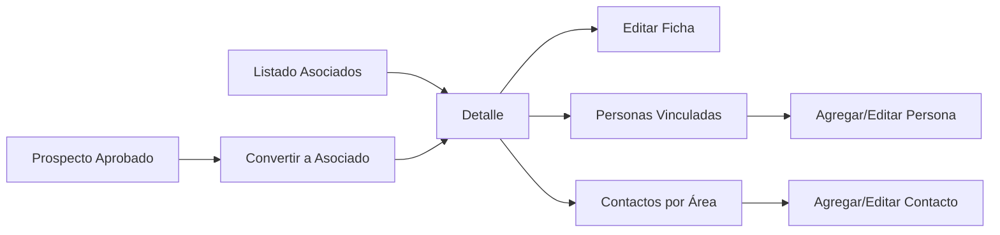
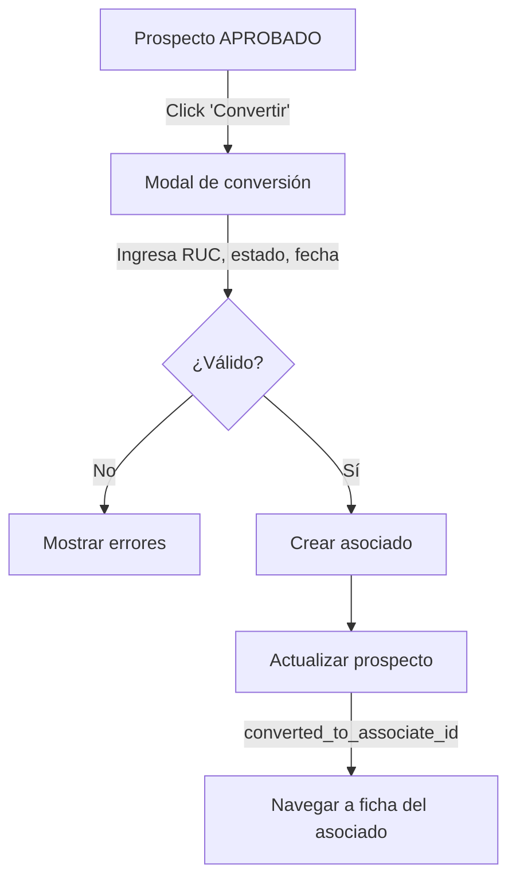

# Hito 5 — Conversión a Asociado y Ficha Principal: Resumen de Implementación

## ✅ Estado: Implementado y compilado exitosamente

---

## Archivos creados

### 🗄️ Migraciones de base de datos (3 archivos)

| Archivo | Tabla | Descripción |
|---------|-------|-------------|
| [20260317010000_create_associates.sql](file:///Users/areadeti/Proyectos/asociados-mvp/supabase/migrations/20260317010000_create_associates.sql) | `associates` | Tabla principal con 35+ campos, índices, unique en código y RUC, FK a prospects |
| [20260317020000_create_associate_people.sql](file:///Users/areadeti/Proyectos/asociados-mvp/supabase/migrations/20260317020000_create_associate_people.sql) | `associate_people` | Personas vinculadas con rol, datos personales, soft delete |
| [20260317030000_create_associate_area_contacts.sql](file:///Users/areadeti/Proyectos/asociados-mvp/supabase/migrations/20260317030000_create_associate_area_contacts.sql) | `associate_area_contacts` | Contactos por área con función, datos de contacto, soft delete |

### 🔧 Servicios (1 archivo)

| Archivo | Responsabilidad |
|---------|----------------|
| [associates.service.js](file:///Users/areadeti/Proyectos/asociados-mvp/src/services/associates.service.js) | CRUD completo de asociados, generación de código correlativo (ASO-YYYY-XXXX), conversión desde prospecto, CRUD de personas vinculadas, CRUD de contactos por área |

### 🪝 Hooks (2 archivos)

| Archivo | Función |
|---------|---------|
| [useAssociates.js](file:///Users/areadeti/Proyectos/asociados-mvp/src/hooks/useAssociates.js) | Listado con filtros reactivos (search, statusId, categoryId) |
| [useAssociateDetail.js](file:///Users/areadeti/Proyectos/asociados-mvp/src/hooks/useAssociateDetail.js) | Carga paralela de asociado + personas + contactos |

### 🧩 Componentes (9 archivos nuevos)

#### Moléculas de asociados (8)
- [AssociateFilters.jsx](file:///Users/areadeti/Proyectos/asociados-mvp/src/components/molecules/associates/AssociateFilters.jsx) — Barra de búsqueda y filtros
- [AssociateCard.jsx](file:///Users/areadeti/Proyectos/asociados-mvp/src/components/molecules/associates/AssociateCard.jsx) — Tarjeta resumen en listado
- [AssociateForm.jsx](file:///Users/areadeti/Proyectos/asociados-mvp/src/components/molecules/associates/AssociateForm.jsx) — Formulario completo de edición
- [AssociateInfoSection.jsx](file:///Users/areadeti/Proyectos/asociados-mvp/src/components/molecules/associates/AssociateInfoSection.jsx) — Vista de información en detalle
- [PersonForm.jsx](file:///Users/areadeti/Proyectos/asociados-mvp/src/components/molecules/associates/PersonForm.jsx) — Formulario de persona vinculada
- [PersonList.jsx](file:///Users/areadeti/Proyectos/asociados-mvp/src/components/molecules/associates/PersonList.jsx) — Listado de personas vinculadas
- [AreaContactForm.jsx](file:///Users/areadeti/Proyectos/asociados-mvp/src/components/molecules/associates/AreaContactForm.jsx) — Formulario de contacto por área
- [AreaContactList.jsx](file:///Users/areadeti/Proyectos/asociados-mvp/src/components/molecules/associates/AreaContactList.jsx) — Listado de contactos por área

#### Modal de conversión (1)
- [ConvertProspectModal.jsx](file:///Users/areadeti/Proyectos/asociados-mvp/src/components/molecules/associates/ConvertProspectModal.jsx) — Modal para convertir prospecto aprobado a asociado

### 📄 Páginas (3 + 2 secciones)

| Archivo | Descripción |
|---------|-------------|
| [AssociatesPage.jsx](file:///Users/areadeti/Proyectos/asociados-mvp/src/pages/associates/AssociatesPage.jsx) | Listado general con cards, filtros y búsqueda |
| [AssociateDetailPage.jsx](file:///Users/areadeti/Proyectos/asociados-mvp/src/pages/associates/AssociateDetailPage.jsx) | Vista detalle orquestadora con tabs |
| [AssociateEditPage.jsx](file:///Users/areadeti/Proyectos/asociados-mvp/src/pages/associates/AssociateEditPage.jsx) | Edición con pre-carga de datos |
| [AssociateDetailHeader.jsx](file:///Users/areadeti/Proyectos/asociados-mvp/src/pages/associates/sections/AssociateDetailHeader.jsx) | Header del detalle con acciones |
| [AssociateDetailTabs.jsx](file:///Users/areadeti/Proyectos/asociados-mvp/src/pages/associates/sections/AssociateDetailTabs.jsx) | 3 tabs: Info, Personas, Contactos |

### 🛠️ Utilidades (2 archivos)

| Archivo | Descripción |
|---------|-------------|
| [associateConstants.js](file:///Users/areadeti/Proyectos/asociados-mvp/src/utils/associateConstants.js) | Mapeo de estados y salud de pago a variantes de Badge, catalog groups |
| [associateValidation.js](file:///Users/areadeti/Proyectos/asociados-mvp/src/utils/associateValidation.js) | Validación de formularios (asociado, conversión, persona, contacto) |

### 🔀 Archivos modificados (3)

| Archivo | Cambio |
|---------|--------|
| [routes.js](file:///Users/areadeti/Proyectos/asociados-mvp/src/router/routes.js) | Agregadas rutas: ASOCIADOS_DETALLE, ASOCIADOS_EDITAR |
| [AppRouter.jsx](file:///Users/areadeti/Proyectos/asociados-mvp/src/router/AppRouter.jsx) | 3 rutas de asociados con PermissionGuard |
| [ProspectDetailHeader.jsx](file:///Users/areadeti/Proyectos/asociados-mvp/src/pages/prospects/sections/ProspectDetailHeader.jsx) | Botón "Convertir a asociado" + badge "Convertido" |
| [ProspectDetailPage.jsx](file:///Users/areadeti/Proyectos/asociados-mvp/src/pages/prospects/ProspectDetailPage.jsx) | Flujo de conversión con ConvertProspectModal |

---

## Flujo funcional implementado



## Proceso de conversión



## Reglas de negocio implementadas

- **Conversión controlada**: Solo prospectos con estado APROBADO pueden convertirse
- **Prevención de duplicados**: Un prospecto ya convertido no muestra el botón de conversión
- **Código correlativo**: Formato `ASO-YYYY-XXXX` generado automáticamente
- **Datos reutilizados**: Razón social, RUC, nombre comercial, actividad, tipo, tamaño, email, captador y categoría se heredan del prospecto
- **Trazabilidad**: `prospect_origin_id` vincula asociado con su prospecto de origen
- **Trazabilidad inversa**: `converted_to_associate_id` y `converted_at` se actualizan en el prospecto
- **Personas vinculadas**: Representante legal, gerente general, asistente, etc. con soft delete
- **Contactos por área**: Organización por área funcional con soft delete
- **Validaciones**: RUC (11 dígitos), email, campos obligatorios en formularios
- **Soft delete**: Todas las tablas con `is_deleted`, `deleted_at`, `deleted_by`
- **Auditoría base**: `created_by`, `updated_by`, `created_at`, `updated_at` en todas las tablas

## Próximo paso

> [!IMPORTANT]
> Ejecutar las migraciones en Supabase:
> ```bash
> supabase db push
> ```
