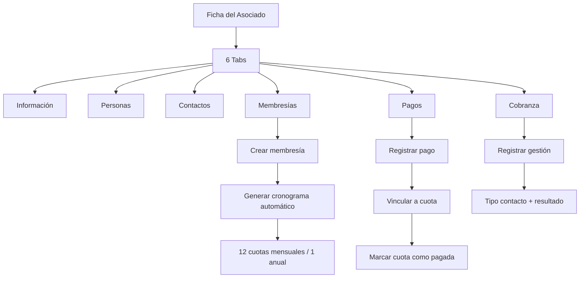

# Hito 6 — Membresías, Pagos y Cobranza: Resumen de Implementación

## ✅ Estado: Implementado y compilado exitosamente

---

## Archivos creados

### 🗄️ Migraciones de base de datos (4 archivos)

| Archivo | Tabla | Descripción |
|---------|-------|-------------|
| [20260317040000_create_memberships.sql](file:///Users/areadeti/Proyectos/asociados-mvp/supabase/migrations/20260317040000_create_memberships.sql) | `memberships` | Tipo, tarifa, vigencia, día de cobro, estado |
| [20260317050000_create_payment_schedules.sql](file:///Users/areadeti/Proyectos/asociados-mvp/supabase/migrations/20260317050000_create_payment_schedules.sql) | `payment_schedules` | Cronograma con período, vencimiento, estado de cobranza |
| [20260317060000_create_payments.sql](file:///Users/areadeti/Proyectos/asociados-mvp/supabase/migrations/20260317060000_create_payments.sql) | `payments` | Pagos reales con código de operación, soporte para reversas |
| [20260317070000_create_collection_actions.sql](file:///Users/areadeti/Proyectos/asociados-mvp/supabase/migrations/20260317070000_create_collection_actions.sql) | `collection_actions` | Gestiones de cobranza con tipo, resultado, seguimiento |

### 🔧 Servicios (4 archivos)

| Archivo | Responsabilidad |
|---------|----------------|
| [memberships.service.js](file:///Users/areadeti/Proyectos/asociados-mvp/src/services/memberships.service.js) | CRUD membresías + generación automática de cronograma |
| [paymentSchedules.service.js](file:///Users/areadeti/Proyectos/asociados-mvp/src/services/paymentSchedules.service.js) | Consulta cronograma, marcado como pagado, eliminación masiva |
| [payments.service.js](file:///Users/areadeti/Proyectos/asociados-mvp/src/services/payments.service.js) | Registro de pagos, reversa |
| [collectionActions.service.js](file:///Users/areadeti/Proyectos/asociados-mvp/src/services/collectionActions.service.js) | CRUD acciones de cobranza |

### 🧩 Componentes financieros (6 archivos)

| Archivo | Función |
|---------|---------|
| [MembershipForm.jsx](file:///Users/areadeti/Proyectos/asociados-mvp/src/components/molecules/financial/MembershipForm.jsx) | Formulario de membresía |
| [MembershipList.jsx](file:///Users/areadeti/Proyectos/asociados-mvp/src/components/molecules/financial/MembershipList.jsx) | Listado de membresías con estado |
| [ScheduleTable.jsx](file:///Users/areadeti/Proyectos/asociados-mvp/src/components/molecules/financial/ScheduleTable.jsx) | Tabla de cronograma de pagos |
| [PaymentForm.jsx](file:///Users/areadeti/Proyectos/asociados-mvp/src/components/molecules/financial/PaymentForm.jsx) | Formulario de registro de pago |
| [PaymentList.jsx](file:///Users/areadeti/Proyectos/asociados-mvp/src/components/molecules/financial/PaymentList.jsx) | Tabla de pagos registrados |
| [CollectionActionForm.jsx](file:///Users/areadeti/Proyectos/asociados-mvp/src/components/molecules/financial/CollectionActionForm.jsx) | Formulario de acción de cobranza |
| [CollectionActionList.jsx](file:///Users/areadeti/Proyectos/asociados-mvp/src/components/molecules/financial/CollectionActionList.jsx) | Listado de gestiones de cobranza |

### 🛠️ Utilidades (2 archivos)

| Archivo | Descripción |
|---------|-------------|
| [financialConstants.js](file:///Users/areadeti/Proyectos/asociados-mvp/src/utils/financialConstants.js) | Mapeo de estados a Badge, catalog groups |
| [financialValidation.js](file:///Users/areadeti/Proyectos/asociados-mvp/src/utils/financialValidation.js) | Validación de formularios financieros |

### 🔀 Archivos modificados (2)

| Archivo | Cambio |
|---------|--------|
| [useAssociateDetail.js](file:///Users/areadeti/Proyectos/asociados-mvp/src/hooks/useAssociateDetail.js) | Carga paralela de membresías, cronograma, pagos y cobranza |
| [AssociateDetailPage.jsx](file:///Users/areadeti/Proyectos/asociados-mvp/src/pages/associates/AssociateDetailPage.jsx) | Handlers para CRUD financiero completo |
| [AssociateDetailTabs.jsx](file:///Users/areadeti/Proyectos/asociados-mvp/src/pages/associates/sections/AssociateDetailTabs.jsx) | 3 tabs nuevos: Membresías, Pagos, Cobranza |

---

## Flujo funcional implementado



## Reglas de negocio implementadas

### Membresías
- Al crear una nueva membresía, las anteriores se marcan como `is_current = false`
- **Membresía MENSUAL**: Genera 12 cuotas con el día de cobro configurado
- **Membresía ANUAL**: Genera 1 cuota en la fecha de inicio
- El cronograma se genera automáticamente al crear la membresía

### Pagos
- Al seleccionar una cuota pendiente, el monto se auto-llena
- Al registrar un pago vinculado a cuota, la cuota se marca como pagada
- Soporte para reversas de pagos con motivo

### Cronograma
- Las cuotas vencidas se resaltan visualmente en rojo
- Indicadores de estado: Pendiente, En gestión, Parcial, Pagado, Vencido, Anulado
- Al eliminar membresía, las cuotas no pagadas se eliminan lógicamente

### Cobranza
- Registro de gestión con tipo de contacto (Correo, Teléfono, WhatsApp, etc.)
- Resultado de la gestión (Contactado, No contactado, Compromiso de pago, etc.)
- Fecha de próximo seguimiento
- Historial cronológico de gestiones por asociado

## Próximo paso

> [!IMPORTANT]
> Ejecutar las migraciones en Supabase:
> ```bash
> supabase db push
> ```
