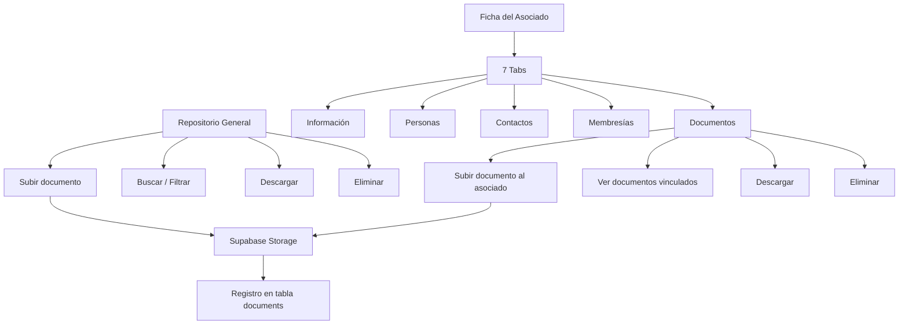

# Hito 7 — Gestión Documental y Almacenamiento: Resumen de Implementación

## ✅ Estado: Implementado y compilado exitosamente

---

## Archivos creados

### 🗄️ Migraciones de base de datos (2 archivos)

| Archivo | Tabla | Descripción |
|---------|-------|-------------|
| [20260324010000_create_storage_nodes.sql](file:///Users/areadeti/Proyectos/asociados-mvp/supabase/migrations/20260324010000_create_storage_nodes.sql) | `storage_nodes` | Árbol lógico de almacenamiento con nodos padre-hijo, tipo, asociado, año/mes |
| [20260324020000_create_documents.sql](file:///Users/areadeti/Proyectos/asociados-mvp/supabase/migrations/20260324020000_create_documents.sql) | `documents` | Metadatos de archivos en Supabase Storage: título, ruta, MIME, tamaño, versión, relaciones |

### 🔧 Servicios (1 archivo)

| Archivo | Responsabilidad |
|---------|----------------|
| [documents.service.js](file:///Users/areadeti/Proyectos/asociados-mvp/src/services/documents.service.js) | Upload a Supabase Storage + registro de metadatos, CRUD completo, versionamiento, URLs firmadas, descarga, soft delete con rollback |

### 🪝 Hooks (1 archivo)

| Archivo | Función |
|---------|---------|
| [useDocuments.js](file:///Users/areadeti/Proyectos/asociados-mvp/src/hooks/useDocuments.js) | Listado con filtros reactivos (search, categoryId, typeId, associateId) |

### 🧩 Componentes (4 archivos nuevos)

#### Moléculas de documentos (4)
- [DocumentUploadForm.jsx](file:///Users/areadeti/Proyectos/asociados-mvp/src/components/molecules/documents/DocumentUploadForm.jsx) — Formulario de carga con zona de selección, validación de extensiones/tamaño, auto-fill de título
- [DocumentCard.jsx](file:///Users/areadeti/Proyectos/asociados-mvp/src/components/molecules/documents/DocumentCard.jsx) — Tarjeta de documento con ícono por extensión, badges de tipo/categoría, acciones
- [DocumentList.jsx](file:///Users/areadeti/Proyectos/asociados-mvp/src/components/molecules/documents/DocumentList.jsx) — Listado de documentos con empty state
- [DocumentFilters.jsx](file:///Users/areadeti/Proyectos/asociados-mvp/src/components/molecules/documents/DocumentFilters.jsx) — Barra de búsqueda y filtros por categoría/tipo

### 📄 Páginas (1)

| Archivo | Descripción |
|---------|-------------|
| [DocumentsPage.jsx](file:///Users/areadeti/Proyectos/asociados-mvp/src/pages/documents/DocumentsPage.jsx) | Repositorio documental general con upload, filtros, listado, descarga y eliminación |

### 🛠️ Utilidades (2 archivos)

| Archivo | Descripción |
|---------|-------------|
| [documentConstants.js](file:///Users/areadeti/Proyectos/asociados-mvp/src/utils/documentConstants.js) | Catalog groups, extensiones permitidas, tamaño máximo, formateo de tamaño, íconos por extensión |
| [documentValidation.js](file:///Users/areadeti/Proyectos/asociados-mvp/src/utils/documentValidation.js) | Validación de formulario de carga y edición de metadatos |

### 🔀 Archivos modificados (4)

| Archivo | Cambio |
|---------|--------|
| [routes.js](file:///Users/areadeti/Proyectos/asociados-mvp/src/router/routes.js) | Agregada ruta DOCUMENTOS_DETALLE |
| [AppRouter.jsx](file:///Users/areadeti/Proyectos/asociados-mvp/src/router/AppRouter.jsx) | Ruta de DocumentsPage con PermissionGuard |
| [useAssociateDetail.js](file:///Users/areadeti/Proyectos/asociados-mvp/src/hooks/useAssociateDetail.js) | Carga paralela de documentos del asociado |
| [AssociateDetailPage.jsx](file:///Users/areadeti/Proyectos/asociados-mvp/src/pages/associates/AssociateDetailPage.jsx) | Handlers de upload, download y delete de documentos |
| [AssociateDetailTabs.jsx](file:///Users/areadeti/Proyectos/asociados-mvp/src/pages/associates/sections/AssociateDetailTabs.jsx) | Nuevo tab "Documentos" con upload y listado |

---

## Flujo funcional implementado



## Reglas de negocio implementadas

### Almacenamiento
- **Supabase Storage**: Los archivos se almacenan en el bucket `documents`
- **Rutas organizadas**: `asociados/{id}/{timestamp}_{filename}` o `prospectos/{id}/...` o `general/...`
- **Rollback**: Si falla el registro de metadatos, el archivo subido se elimina automáticamente
- **URLs firmadas**: Descarga segura con expiración de 1 hora

### Documentos
- **Extensiones permitidas**: PDF, Word, Excel, PowerPoint, imágenes, CSV, TXT, ZIP, RAR
- **Tamaño máximo**: 20 MB por archivo
- **Auto-fill**: El título se pre-llena con el nombre del archivo (sin extensión)
- **Versionamiento**: Soporte para reemplazo controlado con `replaces_document_id` y `version_number`
- **Solo última versión**: Los listados muestran únicamente `is_latest_version = true`
- **Soft delete**: `is_deleted`, `deleted_at`, `deleted_by` en todas las tablas
- **Auditoría**: `created_by`, `uploaded_by_user_id`, `uploaded_at`, `updated_at`

### Integración
- **Ficha del asociado**: Nuevo tab "Documentos" muestra los documentos vinculados
- **Carga paralela**: Los documentos se cargan junto con la demás información del asociado
- **Clasificación**: Por tipo documental (Acta, Oficio, Certificado, etc.) y categoría (Comités, Socios, etc.)

### Estructura de la tabla storage_nodes
- **Árbol lógico**: Nodos con relación padre-hijo para organización jerárquica
- **Vinculación**: Puede asociarse a un asociado, comité o contexto temporal (año/mes)
- **Sistema**: Soporte para nodos generados automáticamente (`is_system_generated`)

## Próximo paso

> [!IMPORTANT]
> Ejecutar las migraciones en Supabase:
> ```bash
> supabase db push
> ```
> 
> Crear el bucket `documents` en Supabase Storage desde el dashboard o CLI.
