# Hito 8 — Reportes, Exportaciones y Automatizaciones: Resumen de Implementación

## ✅ Estado: Implementado y compilado exitosamente

---

## Archivos creados

### 🔧 Servicios (1 archivo)

| Archivo | Responsabilidad |
|---------|----------------|
| [reports.service.js](file:///Users/areadeti/Proyectos/asociados-mvp/src/services/reports.service.js) | Consultas centralizadas de reportes para todos los módulos: prospectos, asociados, membresías, pagos, cronogramas, acciones de cobranza, documentos y KPIs agregados |

### 🛠️ Utilidades (1 archivo)

| Archivo | Descripción |
|---------|-------------|
| [exportUtils.js](file:///Users/areadeti/Proyectos/asociados-mvp/src/utils/exportUtils.js) | Exportación a Excel (.xlsx) con SheetJS + file-saver. Single-sheet y multi-sheet. Columnas predefinidas para todos los módulos. Soporta valores anidados (`category.name`) |

### 🪝 Hooks (1 archivo)

| Archivo | Función |
|---------|---------|
| [useReportData.js](file:///Users/areadeti/Proyectos/asociados-mvp/src/hooks/useReportData.js) | Carga reactiva de datos de reporte según tipo (prospects, associates, memberships, payments, schedules, collections, documents, kpis) |

### 🧩 Componentes (4 archivos nuevos)

| Componente | Descripción |
|-----------|-------------|
| [ReportKpiCard.jsx](file:///Users/areadeti/Proyectos/asociados-mvp/src/components/molecules/reports/ReportKpiCard.jsx) | Tarjeta de KPI reutilizable con ícono, valor, subtítulo y color de acento |
| [DistributionChart.jsx](file:///Users/areadeti/Proyectos/asociados-mvp/src/components/molecules/reports/DistributionChart.jsx) | Gráfico de distribución horizontal con barras proporcionales, porcentajes y colores configurables |
| [ReportSection.jsx](file:///Users/areadeti/Proyectos/asociados-mvp/src/components/molecules/reports/ReportSection.jsx) | Sección de reporte con título, conteo de registros y botón de exportación |
| [ReportTable.jsx](file:///Users/areadeti/Proyectos/asociados-mvp/src/components/molecules/reports/ReportTable.jsx) | Tabla de datos con formateo automático (fecha, moneda, badge, booleano), valores anidados, truncamiento y click en fila |

### 📄 Páginas (1)

| Archivo | Descripción |
|---------|-------------|
| [ReportsPage.jsx](file:///Users/areadeti/Proyectos/asociados-mvp/src/pages/reports/ReportsPage.jsx) | Página principal de reportes con 6 pestañas (Resumen, Prospectos, Asociados, Membresías, Pagos/Cobranza, Documentos). Cada pestaña incluye KPIs, gráficos de distribución, tablas de datos y exportación individual a Excel. Incluye botón "Exportar todo" para generar un Excel multi-hoja |

### 📦 Dependencias instaladas (2)

| Paquete | Uso |
|---------|-----|
| `xlsx` (SheetJS) | Generación de archivos Excel (.xlsx) |
| `file-saver` | Descarga de archivos generados en el navegador |

### 🔀 Archivos modificados (3)

| Archivo | Cambio |
|---------|--------|
| [AppRouter.jsx](file:///Users/areadeti/Proyectos/asociados-mvp/src/router/AppRouter.jsx) | Ruta `/reportes` con ReportsPage + PermissionGuard |
| [MembershipsPage.jsx](file:///Users/areadeti/Proyectos/asociados-mvp/src/pages/financial/MembershipsPage.jsx) | Botón "Exportar Excel" para exportar membresías filtradas |
| [PendingPaymentsPage.jsx](file:///Users/areadeti/Proyectos/asociados-mvp/src/pages/financial/PendingPaymentsPage.jsx) | Botón "Exportar Excel" para exportar cuotas pendientes |

---

## Estructura de la página de Reportes

```mermaid
flowchart TD
    R[Reportes] --> T1[Resumen]
    R --> T2[Prospectos]
    R --> T3[Asociados]
    R --> T4[Membresías]
    R --> T5[Pagos y Cobranza]
    R --> T6[Documentos]

    T1 --> K1[7 KPI Cards]
    T1 --> C1[Distribución prospectos]
    T1 --> C2[Distribución asociados]

    T2 --> K2[Chart por estado]
    T2 --> E2[Tabla + Export Excel]

    T3 --> K3[Chart estado + categoría]
    T3 --> E3[Tabla + Export Excel]

    T4 --> K4[4 KPIs + Charts]
    T4 --> E4[Tabla + Export Excel]

    T5 --> K5[4 KPIs financieros]
    T5 --> C5[Charts método/estado]
    T5 --> E5A[Tabla pagos + Export]
    T5 --> E5B[Tabla cronograma + Export]

    T6 --> K6[3 KPIs]
    T6 --> C6[Charts tipo/categoría]
    T6 --> E6[Tabla + Export Excel]

    R --> EA[Exportar Todo → Excel multi-hoja]
```

## Funcionalidades implementadas

### Reportes operativos
- **Prospectos**: por estado, categoría, captador
- **Asociados**: por estado, categoría, salud de pago
- **Membresías**: vigentes/vencidas, por tipo, tarifas totales
- **Pagos**: total recaudado, por método de pago
- **Cobranza**: pendientes, vencidas, por estado
- **Documentos**: por tipo, categoría, asociado

### Exportaciones a Excel
- **Por módulo**: cada pestaña tiene botón "Exportar Excel" individual
- **Exportar todo**: botón global genera Excel con 6 hojas (uno por módulo)
- **En listados**: Membresías y Cobranza ahora tienen botón de exportación directa
- **Formato**: columnas predefinidas con formateo de fechas y moneda

### Paneles e indicadores
- **KPI Cards**: métricas clave con íconos, valores formateados, navegación
- **Distribution Charts**: barras horizontales con porcentajes y colores por estado
- **Report Tables**: tablas con formateo automático (badge, fecha, moneda, booleano)

### Base para automatizaciones
- **reportsService.getDashboardKpis()**: agregaciones listas para alertas o crons
- **Estructura modular**: fácil agregar nuevos reportes o indicadores
- **Separación de capas**: servicio → hook → componente → página

---

## Cierre del producto base

> [!IMPORTANT]
> Con los 8 hitos completados, el **Sistema de Asociados** cuenta con:
> - Gestión completa de prospectos, asociados, membresías, pagos y cobranza
> - Módulo documental con upload a Supabase Storage
> - Reportes operativos con gráficos y exportación a Excel
> - Arquitectura modular lista para evolución futura
